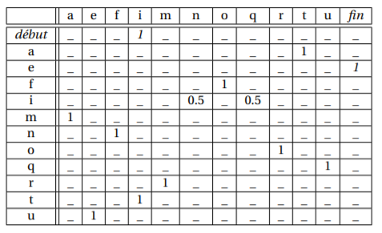
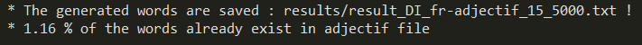
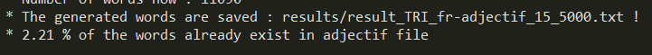
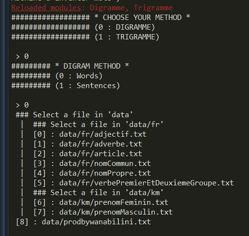
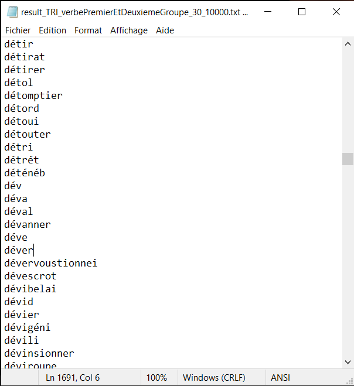
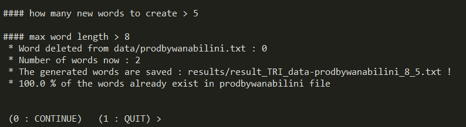

# Word inventing machine

We built a program using python able to invent words or simple sentences. (:fr:)  
Il existe plusieurs façons de générer aléatoirement des mots. Parmi toutes celles existantes, ce programme utilise deux méthodes pour former des mots : les méthodes d'enchainements digrammes et trigrammes.

### ⚙ How to run it
- Choisir la méthode de création voulu (digramme or trigramme)
- Selectionner le fichier/dictionnaire source sur lequel se baser pour créer nos mots
- Saisir le nombres de nouveaux mots que vous voulez créer
- Saisir la taille maximum que doivent faire ces mots

Vos nouveaux mots seront stockées dans un fichier .txt rangé dans le dossier /results !

Pour rappel, la langue française est composée de 42 lettres, les 26 lettres de l’alphabet latin : 13 voyelles accentuées, le graphème ç, ainsi que les deux ligatures (æ, œ), et aussi le symbole. Après avoir choisie un dictionnaire de base, les mots de celui qui ne respecterons pas cette alphabet ne seront pas pris en compte.

### 🔩 The methods used to create the words

#### • Enchainement de *digrammes*
Afin de générer des mots plus plausibles, à la lecture, nous orientons le choix de chaque lettre selon des règles probabilistes d’enchaînement de deux lettres.  

Pour pouvoir générer des mots à partir de digrammes, il faut dans un premier temps disposer d’un dictionnaire (une liste de mots). Puis pour chaque mot de ce dictionnaire, pour chaque lettre, regarder quelle est la lettre suivante, et mettre à jour la table de probabilité. Il peut être utile de mémoriser quelles lettres commencent un mot, et lesquelles terminent un mot.  

Par exemple, avec le mot informatique, on extrait la table de probabilités suivante :  
  

Une fois la table complète de probabilités calculée, il suffit de partir d’une lettre, et d’enchaîner les lettres en fonction de la table de probabilité. En suivant le tableau ci-dessus, et en partant de la lettre 't', on génère le mot 'tique'.   
Bien évidemment, cela n’a aucun sens de faire une table de probabilités sur un seul mot. <u>Plus on prend de mots en compte, plus la table de probabilités reflète correctement l’enchaînement des lettres dans la langue</u>.

#### •• Enchaînement de *trigrammes*
La méthode des trigrammes suit la même procédure que la méthode des digrammes, mais au lieu de ne considérer qu’une seule lettre pour regarder la suivante, on considère les deux précédentes. Cela crée une table de probabilités plus conséquente, mais beaucoup plus fine pour la création de mot.

### 📌 Résultats
Comparons les résultats obtenu avec les méthodes dit diagramme et trigramme, après avoir sélectionné une liste de 11 mille adjectifs français. Pour des paramètres égaux (nb de nouveau mots = 5000 ET taille max d'un nouveau mot = 15) on obtient :   

[Nouveaux Verbe | DIGRAMME](results/result_DI_fr-adjectif_15_5000.txt "cliquez pour voir les mots crées")  

[Nouveaux Verbe | TRIGRAMME](results/result_TRI_fr-adjectif_15_5000.txt "cliquez pour voir les mots crées")

On observe que certains mots paraissent français mais ne le sont pas haha !

   
Aussi on pourra remarquer que le % de nouveau mot crée avec le trigramme, déjà existant dans la liste de 6 mille verbes (donc le % de mots qui existent belle et bien !) est superieur au % de nouveau mots crée avec le digramme.

---
### 🎳 Bonus

####  Créer de nouveaux prénoms Comorien 🇰🇲
de Webscrapping de commnet j'ai pris les données des commores et pk
 j'ai montré à ma mère elle a valider blabalba c'est vrai
####  Créer des noms aléatoires pour mes prods 🎹
 

---
### 📸 Screenshots 

---
### 👨🏾‍💻👨🏼‍💻 Auteurs
[Mlamali SAID SALIMO](https://www.linkedin.com/in/mlamalisaidsalimo) and [Josh Bonacorsi](https://www.linkedin.com/in/joshuabonacorsi).  
