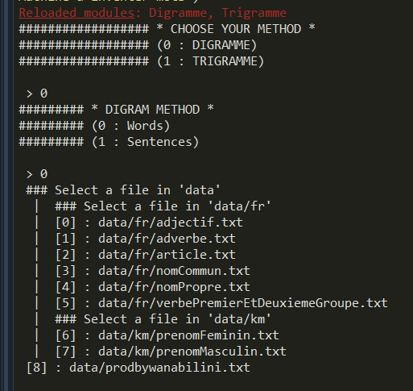
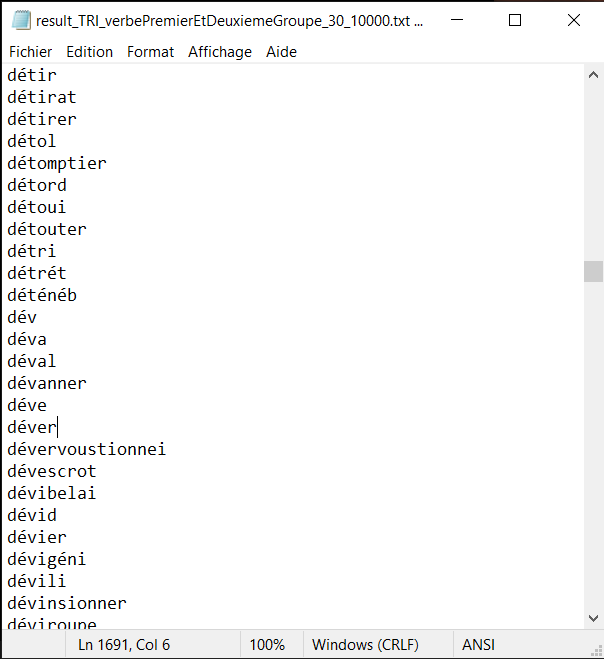

# Word inventing machine

We built a program using python able to invent words and simple sentences.

### words

### sentences

### 📸 Screenshots 

---
### 📌 Comments

parlé de %
de Webscrapping de commnet j'ai pris les données des commores et pk

### 👨🏾‍💻👨🏼‍💻 Auteurs
[Mlamali SAID SALIMO](https://www.linkedin.com/in/mlamalisaidsalimo) and [Josh Bonacorsi](https://www.linkedin.com/in/joshuabonacorsi).  
